# Halo_Serdes GUI 图文导览 / Visual Tour

一份逐标签页的截图导览。GUI 用法与安装见 [`GUI.md`](GUI.md);下面每张图都是本地启动
`halo-serdes-gui` 后实跑截取。两个演示配置:

- **场景 A** — `NRZ 16G mixed-signal` 预设(CTLE + 4-tap DFE + bang-bang CDR,touchstone 背板)。
- **场景 B** — `PAM4 224G ADC` 预设(106.25 GBd,TI-ADC + 数字 FFE/DFE + MM-CDR,解析信道)。

```bash
pip install -e ".[gui,jit,fec]"
halo-serdes-gui        # → http://127.0.0.1:8050/
```

---

## 1. Single Run — 单次链路总览
结果卡(pre-FEC BER / SER / slicer SNR / TJ@1e-12 / 引擎耗时)、密度眼图、slicer 输入直方图
(带判决电平线)、收敛后的 FFE/DFE 抽头。顶部是全部 15 个能力标签页。

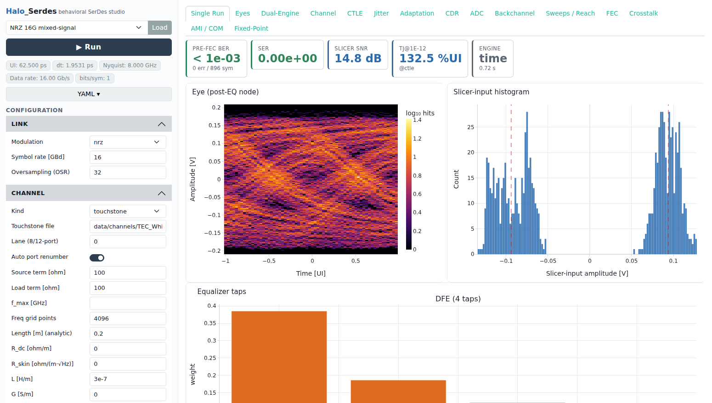

## 2. Eyes — 多观测点眼图
左:从 LTI 前端**重建**的模拟眼(`halo_serdes.analysis.reconstruct`,示例与 GUI 共用);
右:引擎捕获的均衡后 slicer 输入眼。ADC 架构下右侧提示"眼在数字域打开"。

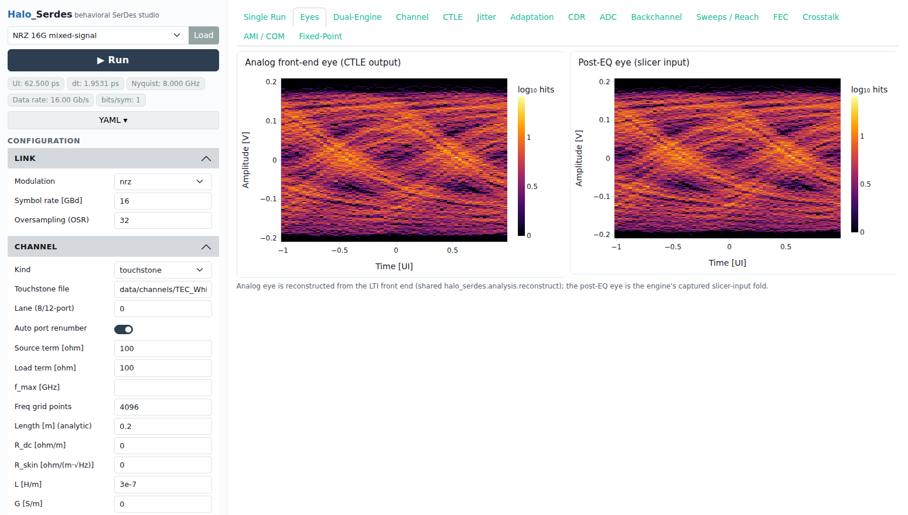

## 3. Dual-Engine — 双引擎交叉校验
统计 StatEye 眼(log-PDF)、相位浴盆(叠加时域 MC 点)、slicer PDF 的统计-vs-MC 对照——
本框架相对三个参考库的最大差异化增量。

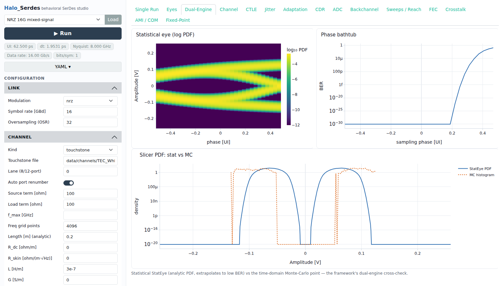

## 4. Channel — 信道特征
插入损耗 Bode(带 Nyquist 线)、冲激响应、脉冲响应 + UI 光标,以及行为级 COM 卡片/分解。

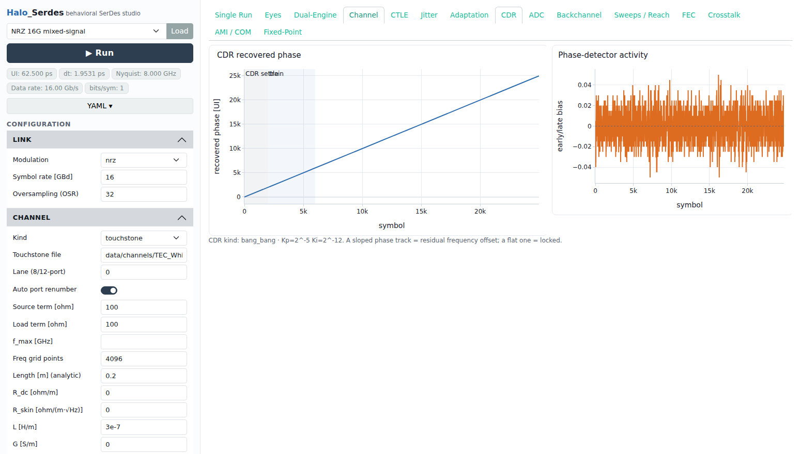

## 5. CTLE — 连续时间线性均衡器频响
CTLE 传函 |H(f)| 与实现峰化;零点/极点默认由峰化目标与 Nyquist 推导,可在配置里覆盖。

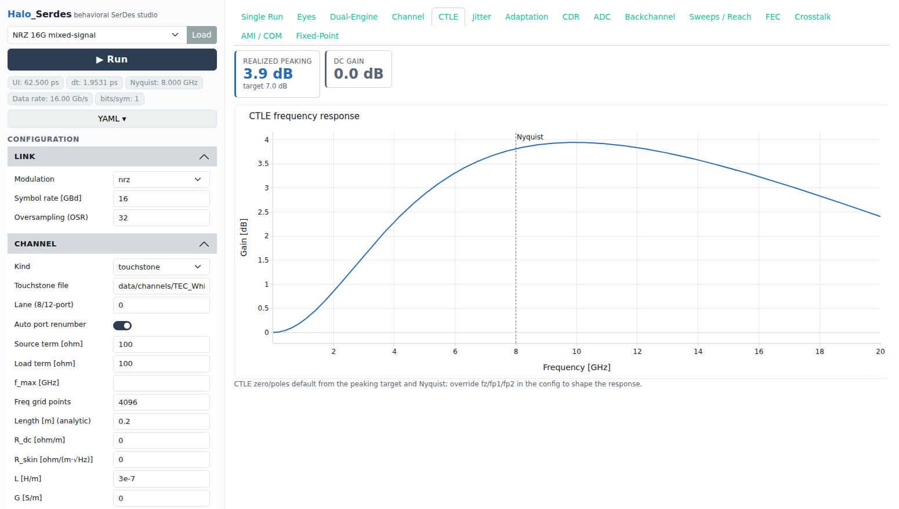

## 6. Jitter — 逐级抖动预算
PyBERT 式三层分解在 Tx / 信道 / CTLE 后三个观测点:预算表 + 堆叠条(ISI/DCD/Pj/Rj 尾 + TJ 标记)
+ 定时浴盆。需要重复码型(≥4 周期,如 prbs7)。

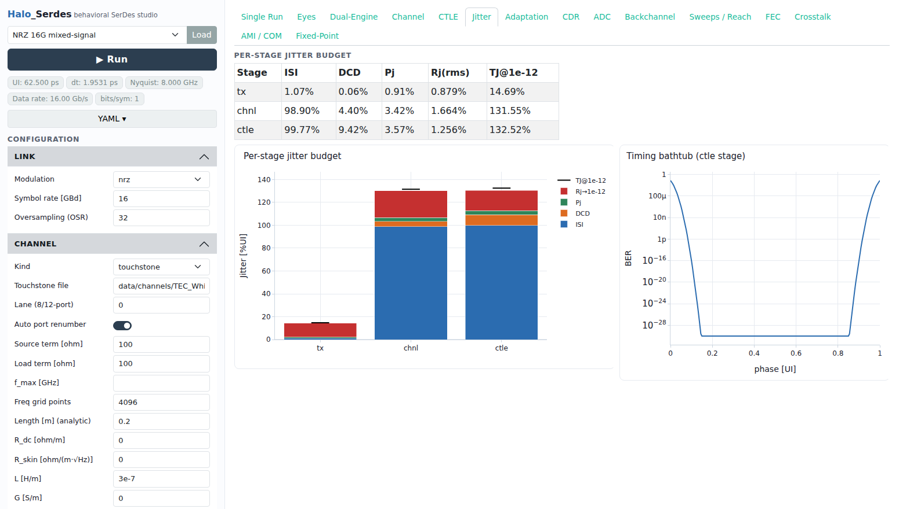

## 7. Adaptation — 自适应收敛
DFE 抽头轨迹(虚线=收敛值,阴影=CDR-settle / data-aided 训练窗)与抽头矢量收敛学习曲线。

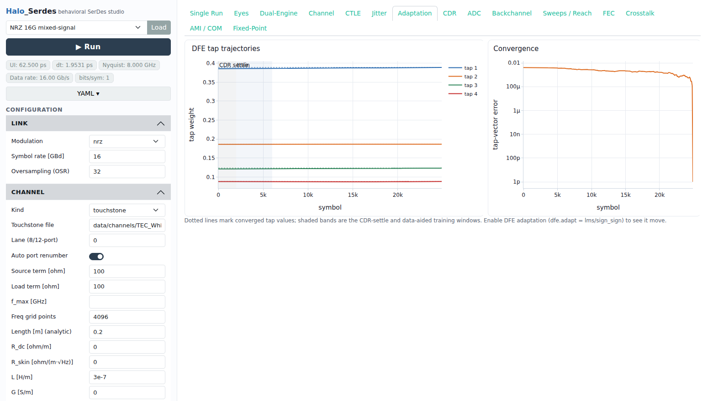

## 8. CDR — 时钟恢复动态
恢复相位的捕获轨迹(斜率=残余频偏,平坦=锁定)与相位检测器活动。

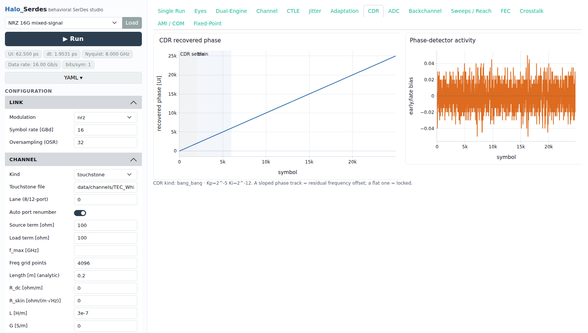

## 9. ADC — ADC-based 接收机诊断
逐 lane SER 条、ADC 码直方、时间交织失配(offset/skew)、收敛后 15-tap FFE + 1-tap DFE。

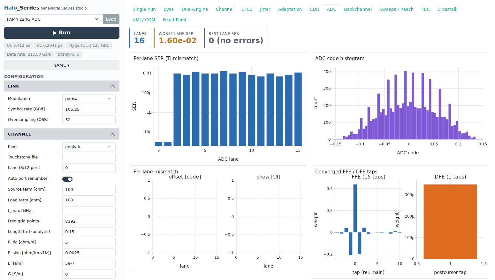

## 10. Backchannel — Tx FIR 训练
KR 式符号 LMS 反向通道训练:cursor/main 比与 Tx 抽头随轮次的轨迹(RX DFE 覆盖的后光标不计入目标)。

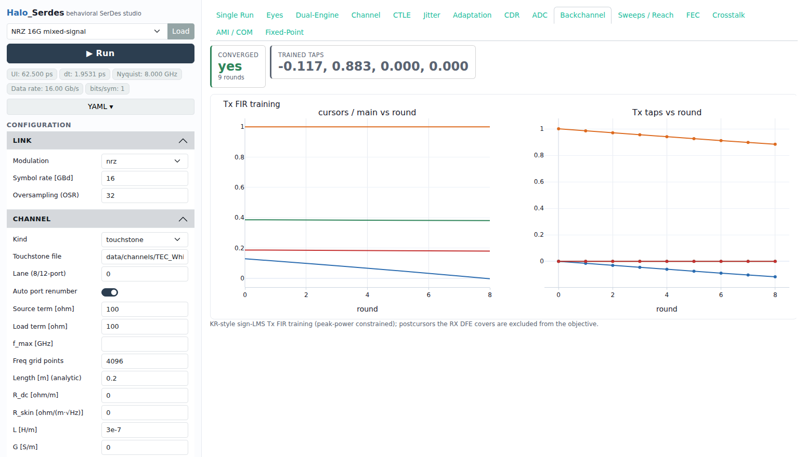

## 11. Sweeps / Reach — reach 扫描
统计引擎沿信道插损扫描 pre-FEC 与 post-KP4/KR4 BER,插值 1e-15 交点给出 reach。

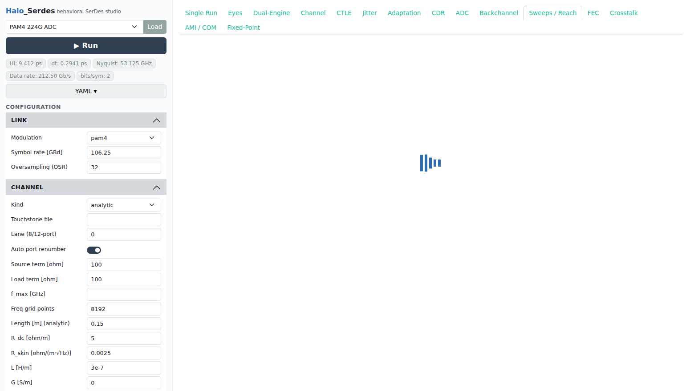

## 12. FEC — 前向纠错投影
KP4/KR4 与级联内码的 pre→post-FEC BER 投影,并标注本次运行的 pre-FEC 工作点。

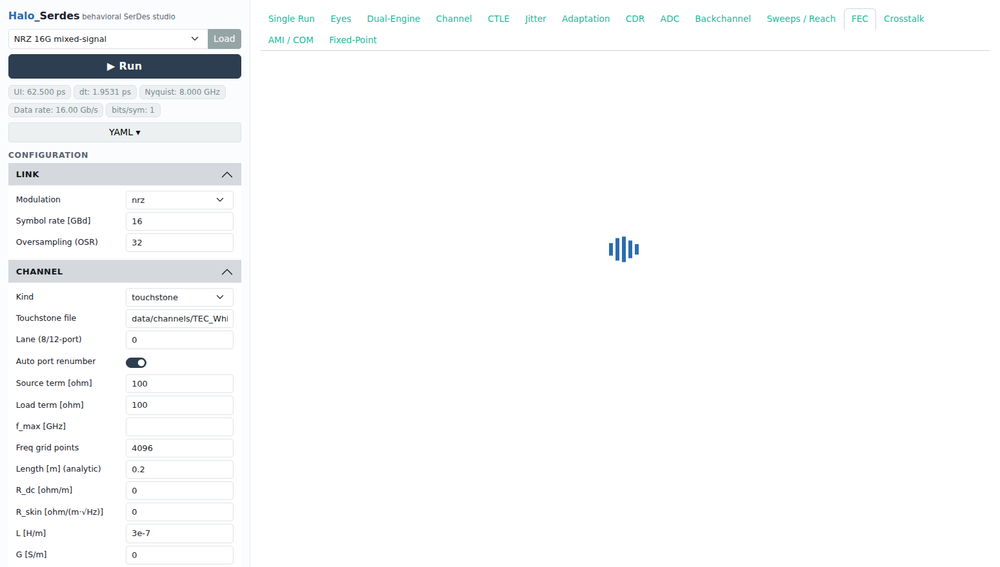

## 13. Crosstalk — 串扰
一对 FEXT+NEXT 合成侵略者在统计引擎中的耦合强度扫描 BER(同一 `XtalkAggressor` 也驱动时域引擎)。

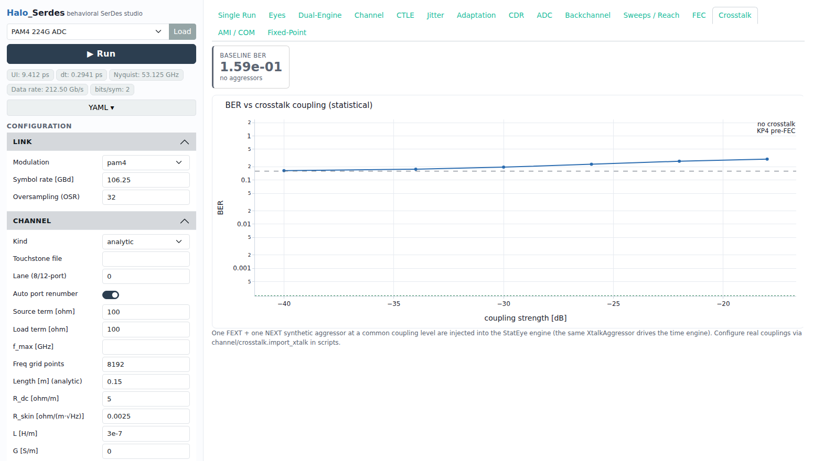

## 14. AMI / COM — 产业接口
行为级 COM vs 插损(过 ≈3 dB 判定线),经 `ComAdapter.compute` 接口——官方 802.3 工具走同一接口;
顶部显示 IBIS-AMI 后端(pyibisami)可用状态。

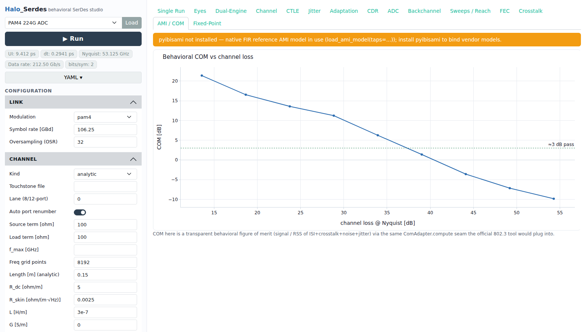

## 15. Fixed-Point — 定点字长
对捕获的 ADC 码做定点数据通路 bit-true 回放,扫描 FFE/DFE 权重字长得到 BER 墙(含 DragonPHY2 10b 硅参考线)。

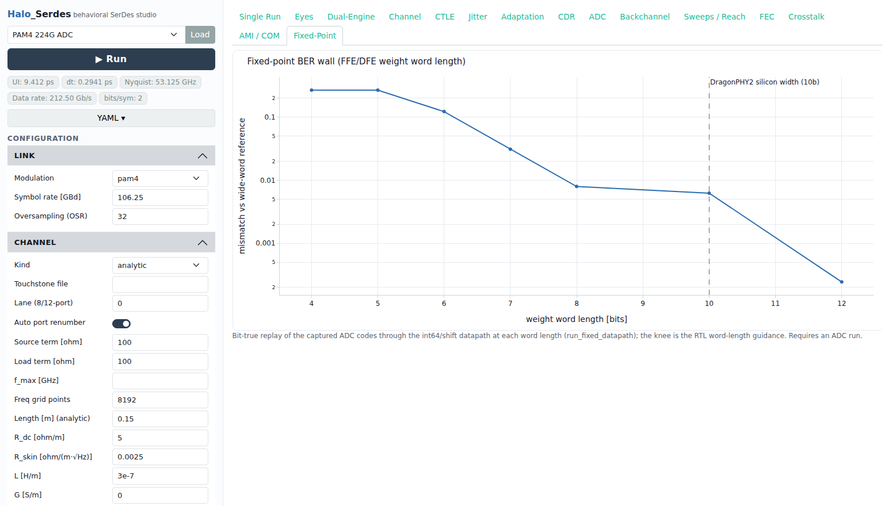

---

> 全部 15 个标签页覆盖 25 个示例脚本的完整能力;GUI 不新增任何仿真逻辑,只驱动现有引擎
> 并渲染 `SimResult` / `StatResult`。
