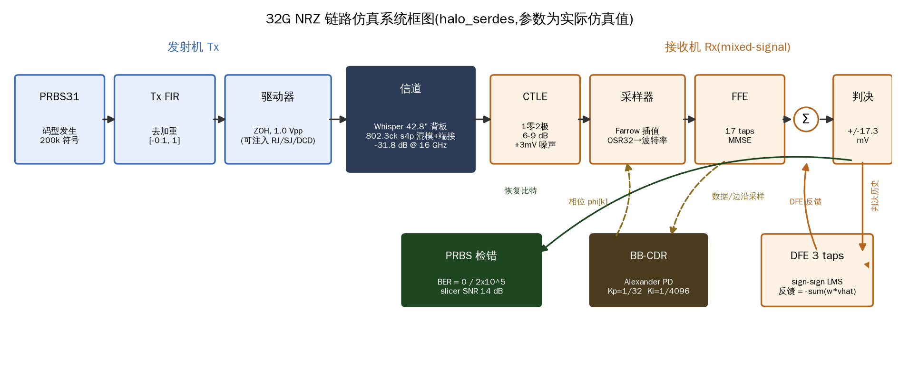

# Halo_Serdes 工程总结 / Engineering Summary

> 系统行为级高速 SerDes 仿真框架 —— 从三个开源库,到 224G 的架构决策工具
> Behavioral high-speed SerDes simulation framework — from three open-source libraries to a 224G architecture decision tool
>
> 📊 图文并茂的中英双语版见 **[`docs/summary.html`](summary.html)**(可在浏览器打开,支持中英切换与明暗主题)。
> A rich bilingual illustrated version is in **[`docs/summary.html`](summary.html)** (open in a browser; language toggle + light/dark theme).
>
> ⚠️ 下文内嵌的插图来自 `examples/output/`,那是**运行示例脚本生成的产物**,按仓库策略不入库
> (`.gitignore`)。直接在 GitHub 上浏览会看到碎图 —— 先运行对应示例即可生成,例如
> `python examples/03_eq_eye_nrz32.py`、`python examples/16_adc_eyes.py`。
> The inline figures below come from `examples/output/`, which is generated by running the
> example scripts and is gitignored by repo policy — run the corresponding example
> (e.g. `python examples/03_eq_eye_nrz32.py`) to produce them.

**224G reach 阶梯 / The 224G reach ladder**

| 18 dB (C2M) | 28 dB (MR) | 35 dB (LR) | 41 dB (Deep LR) |
|---|---|---|---|
| FFE+DFE 基线 | +MLSD | +更好 ADC 或级联 FEC | 全栈组合 |
| FFE+DFE baseline | +MLSD | +better ADC / concat FEC | full stack |

---

## 00 · 缘起:三个开源库 / Origin: three reference libraries

项目从对三个开源 SerDes 项目的逐文件深度分析开始,它们恰好覆盖"算法 → 仿真器 → 硅实现"三个层次,构成自研框架的蓝本。
The project began with a file-by-file analysis of three open-source SerDes projects spanning three layers — algorithm, simulator, silicon — forming the blueprint.

- **serdespy**(Algorithm)—— 多伦多大学 Carusone 组。最小可读的全链路实现;教学级,作蓝本不作依赖 / Minimal readable full-link implementation; a blueprint, not a dependency.
- **DragonPHY2**(Silicon RTL)—— Stanford VLSI。ADC-based 接收机的可流片 RTL + "Python 黄金模型 ↔ RTL lockstep" 验证方法学 / Tape-out RTL for an ADC-based RX + golden-model lockstep methodology.
- **PyBERT**(Simulator)—— David Banas,12 年演进。S 参数/抖动分解/IBIS-AMI/COM,最扎实的行为级参考 / The most battle-tested behavioral reference.

> **调研即已发现 / Found during the survey**：复现 serdespy 黄金数据时,数值确认了它两个未公开瑕疵——端接参考阻抗单端/差分混用、端口置换不完整。自研框架都做对了。 / Numerically confirmed two serdespy quirks (SE-vs-diff termination mixing, incomplete port permutation), both handled correctly here.

---

## 01 · 框架:六个阶段 / The framework: six phases

约 14,000 行 Python(核心库 5.3k / GUI 2.6k / 测试 2.9k / 示例 3.4k)、**297 项测试**、双引擎(时域 + StatEye 统计)、31 个实验脚本。
~14,000 lines of Python, **297 tests**, dual engines (time-domain + StatEye), 31 example scripts.

| Phase | 内容 / Content | 关键验证 / Key check |
|---|---|---|
| 0 | 配置单源 · 信道层 / config single-source · channel | vs PyBERT 黄金冲激响应 / golden impulse |
| 1 | NRZ 32G 最小链路 · ZF/MMSE FFE | AWGN BER = Q(A/σ) 解析对照 |
| 2 | 时域引擎 · mixed-signal RX | ±200ppm 频偏斜坡闭式对照 |
| 3 | StatEye 统计引擎 / statistical engine | 与蒙特卡洛比值 1.03× |
| 4 | ADC-based 架构 / ADC-based RX | 10⁶ 符号 @106GBd:OSR16 8.1s / OSR32 11.6s |
| 5 | MLSD · RS-FEC · 抖动分解 | MLSE 增益 vs 解析 d_min |
| 6 | 定点双模式 · RTL 黄金向量 / bit-true · RTL vectors | vs 独立整数参考逐位一致 |

---

## 02 · 探索一:mixed-signal 架构的边界 / Exploration I: the mixed-signal envelope

传统 mixed-signal 接收机(CTLE + DFE + bang-bang CDR)必须在判决器之前的模拟域把眼打开。
The traditional mixed-signal RX must open the eye in the analog domain before the slicer.

**均衡后眼图 / Post-EQ eyes**：-32 dB 信道下均衡前眼完全闭合,FFE 后张开,FFE+DFE 后采样时刻内眼 6.5 mV。DFE 眼在 ±0.5 UI 的阶梯不连续是 UI 边界反馈切换的标志。
Under −32 dB the pre-EQ eye is fully closed; after FFE+DFE the inner eye is 6.5 mV. The ±0.5 UI staircase is the signature of UI-boundary feedback.

**产品级分工 / Product partition**：产品级 mixed-signal 接收机**不含 RX FFE**。线性均衡是 Tx FIR(backchannel 训练)+ RX CTLE + RX DFE;多抽头 RX FFE 只在 ADC 架构里是真实电路。框架据此实现了 KR 式 backchannel Tx 训练。
A product mixed-signal RX carries **no RX FFE**. The split is Tx FIR (backchannel-trained) + RX CTLE + RX DFE. The framework implements KR-style backchannel Tx training.

> CTLE 名义 4 dB 峰化实测仅 1.5 dB(2×Nyquist 次极点压低 boost);ADC 架构只需 1.5 dB 轻均衡,mixed-signal 要 8.6 dB。 / Nominal 4 dB peaking realizes only 1.5 dB; ADC needs 1.5 dB light EQ vs mixed-signal's 8.6 dB.

**速率上限 / Rate ceiling**：Whisper 背板上 NRZ 约 -30 dB、PAM4 约 -20.5 dB 闭眼,差值恰为 PAM4 的 9.5 dB 电平代价。
NRZ closes at ~−30 dB, PAM4 at ~−20.5 dB — the 9.5 dB gap is the PAM4 level penalty.

据此定出三层产品级包络(框架默认):**NRZ ≤16 Gb/s / PAM4 ≤32 Gb/s**(默认锚点),舒适区 NRZ 24 / PAM4 32,绝对极限 NRZ 30 / PAM4 36,**30 GBd 硬顶**(代表未建模的电路墙:CTLE 增益带宽、判决器孔径、时钟分发抖动)。
This calibrated a three-tier envelope (framework default): NRZ ≤16 / PAM4 ≤32 Gb/s anchor; comfort 24/32; limit 30/36; **30 GBd hard ceiling** (unmodeled circuit walls).

**自适应与时钟恢复 / Adaptation & clock recovery**

> **过程中的真 bug / A real bug**：慢方向 -200 ppm 频偏最初不跟踪,定位到 `jittered_zoh` 累计时移超过 1 UI 被静默削平,重写后修复,频偏测试改为双向。 / The −200 ppm slow direction failed to track — `jittered_zoh` clipped cumulative shifts beyond 1 UI; fixed, test now bidirectional.
>
> **方法论 / Methodology**：锁定检测必须用相位平稳性(PD 均值/周期均值会被牵引期乱码骗过);眼高必须按真实符号分组(按阈值分组恒≥0,测不出闭眼)。 / Lock detection needs phase stationarity; eye height must group by the true symbol.

---

## 03 · 探索二:ADC-based 架构 / Exploration II: the ADC-based RX

56G 之后的架构:轻 CTLE + 时间交织 ADC + 数字 FFE/DFE/MLSD + MM-CDR。均衡整体搬到数字域。
The post-56G architecture: light CTLE + TI-ADC + digital FFE/DFE/MLSD + MM-CDR. EQ moves wholesale to digital.

| 链路 / Link | Nyquist | 插损 / Loss | pre-FEC BER | SNR | post-KP4 |
|---|---|---|---|---|---|
| 112 Gb/s PAM4 | 28 GHz | −10.1 dB | 1.5e-6 | 22.9 dB | 7.5e-50 |
| 224 Gb/s PAM4 | 56 GHz | −18.2 dB | 7.6e-5 | 18.9 dB | 9.8e-23 |

**眼图在哪里?闭在模拟,开在数字 / Where is the eye? Closed in analog, open in digital**

> 224G 那一行:眼在 ADC 输入处完全闭合(左),在数字域被重新打开(中);DSP 真实所见只是离散采样点(右)。这就是 ADC 架构的存在理由,也是为什么主指标是 slicer SNR/SER 而非眼高。 / At 224G the eye is fully closed at the ADC input and reopened digitally; the DSP sees only discrete points. This is the rationale for ADC receivers.

---

## 04 · 探索三:深 LR 的三个杠杆 / Exploration III: three levers for deep long-reach

前面的 224G demo 是 -18 dB 的 C2M 温和信道;真实 802.3dj 长距是 35-45 dB。逐一加码量化每个杠杆,发现它们作用在正交环节上、可以叠加。
The earlier demos used a benign −18 dB C2M channel; real 802.3dj LR is 35-45 dB. Each lever acts on an orthogonal part of the budget and they stack.

| 杠杆 / Lever | 增益 / Gain | 代价 / Cost |
|---|---|---|
| DSP 深度(DFE + 更深 MLSD)/ DSP depth | +1 dB | 收益递减 / diminishing |
| **ADC 质量**(ENOB 6.5→7.5,噪声减半)/ ADC quality | **+6 dB** | ADC 功耗 / power |
| **级联 FEC**(内码抬高可容忍 pre-FEC)/ concat FEC | **+6 dB** | 开销 6%→24% / overhead |

- **MLSD** 补 FFE 够不着的深度 ISI:-27 dB 处把 FFE-only 的 5.3e-4 拉到 5.0e-5(29× 增益,回到 KP4 瀑布点以下);但 memory-2 约 -28 dB 到极限。 / MLSD covers deep ISI: 29× gain at −27 dB, tops out near −28 dB.
- **深 LR 是 SNR 受限,不是 ISI/DSP 深度受限**——加 DFE + 更深 MLSD 只多 ~1 dB,ADC 采样质量才是大杠杆。 / Deep LR is SNR-limited; DSP depth buys ~1 dB, ADC quality ~6 dB.
- **级联内码**把可容忍 pre-FEC BER 从 2.2e-5 抬到 ~7e-3(300 倍),reach 从 29 到 35.5 dB。 / Concat inner code raises tolerable pre-FEC 300×.

**全栈组合:进入 802.3dj LR / Full stack: into the 802.3dj LR band**

| 配置 / Config | reach | 增益 / gain |
|---|---|---|
| A. KP4 + ADC 6.5(基线 / baseline) | 29.3 dB | — |
| B. + 级联 FEC / concat FEC | 35.5 dB | +6.2 |
| C. + 更好 ADC 7.5 / better ADC | 35.5 dB | +6.2 |
| **D. 全栈 / full stack** | **41.4 dB** | **+12.1** |

> 两个正交的 +6 dB 杠杆几乎线性叠加成 +12 dB:一个改"信号有多干净"(ADC/SNR),一个改"能容忍多脏"(FEC 阈值),正交,所以相加。 / The two orthogonal +6 dB levers stack to +12 dB: one changes how clean the signal is (ADC/SNR), the other how dirty it tolerates (FEC threshold).

---

## 05 · 工程结论 / Engineering conclusions

**架构决策 / Architecture decision**(由符号率而非数据率决定 / by symbol rate, not data rate):

- **≤ 16 GBd → Mixed-signal**:NRZ ≤16 / PAM4 ≤32 Gb/s。CTLE + DFE + BB-CDR,无 RX FFE。模拟域打开眼。
- **> 16 GBd → ADC-based**:TI-ADC + 数字 FFE/DFE/MLSD + MM-CDR。均衡搬到数字域,眼在数字重建。

**224G reach 阶梯:一张全栈权衡表 / a full-stack trade table**

| 里程碑 / Milestone | reach | 手段 / means | 代价 / cost |
|---|---|---|---|
| 基线 ADC-DSP | 18 dB | FFE + 1-tap DFE | DSP 面积/功耗 |
| + MLSD | 28 dB | Viterbi 序列检测 | 状态数指数增长 |
| + DFE + 更深 MLSD | 29 dB | DSP 深度 | 收益递减 |
| + 更好 ADC 或级联 FEC | 35 dB | 单杠杆 +6 dB | ADC 功耗 / FEC 开销 |
| **+ 两者全上** | **41 dB** | 全栈 +12 dB | 功耗 + 开销叠加 |

> **核心论点 / The thesis**：深 LR 是全栈问题,没有单一杠杆能到。每个杠杆单独到顶都会撞上各自的墙——DSP 撞 SNR 墙、FEC 撞 pre-FEC 悬崖、ADC 撞功耗。只有正交组合(ADC 质量 × DSP × FEC)才能从 29 dB 推到 41 dB。这套框架的价值是把每个杠杆的 dB 贡献与代价量化摆出来——给的是一张权衡表,而非一个是非题。
>
> Deep LR is a full-stack problem; no single lever gets there. Each tops out at its own wall — DSP at the SNR wall, FEC at the pre-FEC cliff, ADC at power. Only the orthogonal combination reaches from 29 to 41 dB. The framework's value is quantifying each lever's dB and cost — a trade table, not a yes/no answer.

**贯穿始终的方法论 / Methodology throughout**

1. **可证伪的指标 / Falsifiable metrics** —— 锁定用相位平稳性,眼高按真实符号分组。数学上恒成立的指标测不出失败。
2. **先仿真再定论 / Simulate before concluding** —— PAM4 32G 上限、级联 FEC 增益都是先跑数验证再写进结论。
3. **诚实标注模型边界 / Honest about boundaries** —— 30 GBd 硬顶代表未建模的电路墙;统计引擎非 LTI 近似逐项标注并由时域交叉校验。
4. **bug 由逐层排查定位 / Bugs pinned by tracing** —— jittered_zoh 削平、MM-PD 极性、serdespy 端接混用,都用物理数据而非猜测定位。

---

*Halo_Serdes · 约 3,700 行源码 · 106 项测试 · 双引擎 · 22 个实验脚本 · branch `claude/analyze-three-repos-2iys2n`*
