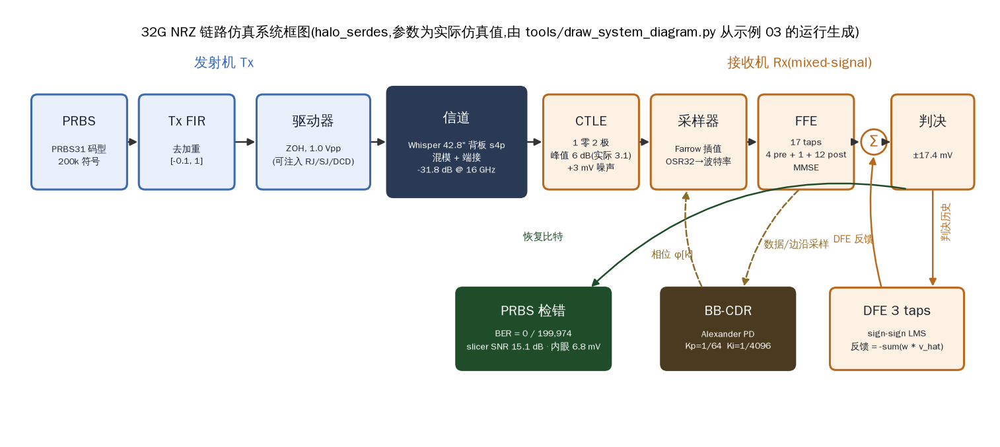

# Halo_Serdes 工程总结 / Engineering Summary

> 系统行为级高速 SerDes 仿真框架 —— 从三个开源库,到 224G 的架构决策工具
> Behavioral high-speed SerDes simulation framework — from three open-source libraries to a 224G architecture decision tool
>
> 📊 图文并茂的中英双语版见 **[`docs/summary.html`](summary.html)**(可在浏览器打开,支持中英切换与明暗主题)。
> A rich bilingual illustrated version is in **[`docs/summary.html`](summary.html)** (open in a browser; language toggle + light/dark theme).
>
> ⚠️ 下文内嵌的插图来自 `examples/output/`,那是**运行示例脚本生成的产物**,按仓库策略不入库
> (`.gitignore`)。直接在 GitHub 上浏览会看到碎图 —— 先运行对应示例即可生成,例如
> `python examples/03_eq_eye_nrz32.py`、`python examples/16_adc_eyes.py`。
> The inline figures below come from `examples/output/`, which is generated by running the
> example scripts and is gitignored by repo policy — run the corresponding example
> (e.g. `python examples/03_eq_eye_nrz32.py`) to produce them.

**224G reach 阶梯 / The 224G reach ladder**

| 18 dB (C2M) | 31–33 dB (MR/LR) | 36–38.5 dB (LR) | 43 dB (Deep LR) |
|---|---|---|---|
| FFE+DFE 基线 | FFE(+MLSD) | +级联 FEC 或更好 ADC | 全栈组合 |
| FFE+DFE baseline | FFE (+MLSD) | +concat FEC / better ADC | full stack |

> **更正 / Correction(2026-10-03)**:探索二到四的数是接收端两处修复后重跑的(起始均衡看见 TX FFE;MM-CDR 在 PAM4 上读
> 均衡后的样本,`cdr.pd_input` 默认 `auto`)。旧阶梯 18 → 28 → 29 → 35 → 41 dB 是在 CDR 锁偏峰值时量的;最大的改变是
> **MLSD 在示例 18 的扫描上不再有增益** —— 原先的 29× 来自锁偏,不来自信道。旧数见 CHANGELOG 2026-10-03。
> Explorations II–IV were rerun after two receiver fixes (the starting equaliser now sees the Tx FFE; MM-CDR reads the
> equalised samples on PAM4). The old 18 → 28 → 29 → 35 → 41 dB ladder was measured with the CDR off the eye's peak;
> the largest change is that **MLSD no longer gains anything on example 18's sweep** — its old 29× came from the lock point.
>
> **再次重跑 / Rerun again(2026-10-03,统计引擎一致性修复后)**:时域接收噪声改为限带(插值采样不再把它稀释到 0.8σ)、
> ADC 路径不再计入 FFE 没判决的尾部符号。阶梯数随之小移:ADC 杠杆 +6.3 → +5.3 dB、级联 FEC +3.6 → +3.8 dB、DSP 深度
> +0.6 → +0.8 dB、全栈 44.0 → 44.2 dB;光互联三拓扑 157 / 254 / 211 → 159 / 256 / 214 m。结论都不变。
> After the statistical-engine consistency fixes (band-limited receiver noise; the ADC path no longer scores the symbols its
> FFE never decided) the ladder moves slightly; every conclusion stands.

---

## 00 · 缘起:三个开源库 / Origin: three reference libraries

项目从对三个开源 SerDes 项目的逐文件深度分析开始,它们恰好覆盖"算法 → 仿真器 → 硅实现"三个层次,构成自研框架的蓝本。
The project began with a file-by-file analysis of three open-source SerDes projects spanning three layers — algorithm, simulator, silicon — forming the blueprint.

- **serdespy**(Algorithm)—— 多伦多大学 Carusone 组。最小可读的全链路实现;教学级,作蓝本不作依赖 / Minimal readable full-link implementation; a blueprint, not a dependency.
- **DragonPHY2**(Silicon RTL)—— Stanford VLSI。ADC-based 接收机的可流片 RTL + "Python 黄金模型 ↔ RTL lockstep" 验证方法学 / Tape-out RTL for an ADC-based RX + golden-model lockstep methodology.
- **PyBERT**(Simulator)—— David Banas,12 年演进。S 参数/抖动分解/IBIS-AMI/COM,最扎实的行为级参考 / The most battle-tested behavioral reference.

> **调研即已发现 / Found during the survey**：复现 serdespy 黄金数据时,数值确认了它两个未公开瑕疵——端接参考阻抗单端/差分混用、端口置换不完整。自研框架都做对了。 / Numerically confirmed two serdespy quirks (SE-vs-diff termination mixing, incomplete port permutation), both handled correctly here.

---

## 01 · 框架:六个阶段 / The framework: six phases

约 25,700 行 Python(核心库 9.8k / 应用层与 GUI 4.2k / 测试 7.3k / 示例 4.4k)、**913 项测试**、双引擎(时域 + StatEye 统计)、40 个实验脚本(2026-10-03 计)。
~25,700 lines of Python, **913 tests**, dual engines (time-domain + StatEye), 40 example scripts (as of 2026-10-03).

| Phase | 内容 / Content | 关键验证 / Key check |
|---|---|---|
| 0 | 配置单源 · 信道层 / config single-source · channel | vs PyBERT 黄金冲激响应 / golden impulse |
| 1 | NRZ 32G 最小链路 · ZF/MMSE FFE | AWGN BER = Q(A/σ) 解析对照 |
| 2 | 时域引擎 · mixed-signal RX | ±200ppm 频偏斜坡闭式对照 |
| 3 | StatEye 统计引擎 / statistical engine | 与蒙特卡洛比值 1.03× |
| 4 | ADC-based 架构 / ADC-based RX | 10⁶ 符号 @106GBd:OSR16 8.1s / OSR32 11.6s |
| 5 | MLSD · RS-FEC · 抖动分解 | MLSE 增益 vs 解析 d_min |
| 6 | 定点双模式 · RTL 黄金向量 / bit-true · RTL vectors | vs 独立整数参考逐位一致 |

---

## 02 · 探索一:mixed-signal 架构的边界 / Exploration I: the mixed-signal envelope

传统 mixed-signal 接收机(CTLE + DFE + bang-bang CDR)必须在判决器之前的模拟域把眼打开。
The traditional mixed-signal RX must open the eye in the analog domain before the slicer.

(图由 `tools/draw_system_diagram.py` 从示例 03 的运行生成,数随代码走;`.mmd` 源与 summary.html 里的副本同时刷新。2026-10-08 前它是手画的,
停在 2026-08 的 slicer SNR 14 dB、±17.3 mV、Kp = 1/32、CTLE "6–9 dB";现为 15.1 dB、±17.4 mV、Kp = 1/64、CTLE 峰值 6 dB(实际 3.1 dB)。/
Drawn by `tools/draw_system_diagram.py` from a run of example 03, so its numbers follow the code; until 2026-10-08 it was hand-drawn and showed 2026-08 values.)

**均衡后眼图 / Post-EQ eyes**：-32 dB 信道下均衡前眼完全闭合,FFE 后张开,FFE+DFE 后采样时刻内眼 6.8 mV。DFE 眼在 ±0.5 UI 的阶梯不连续是 UI 边界反馈切换的标志。
Under −32 dB the pre-EQ eye is fully closed; after FFE+DFE the inner eye is 6.8 mV. The ±0.5 UI staircase is the signature of UI-boundary feedback.

**产品级分工 / Product partition**：产品级 mixed-signal 接收机**不含 RX FFE**。线性均衡是 Tx FIR(backchannel 训练)+ RX CTLE + RX DFE;多抽头 RX FFE 只在 ADC 架构里是真实电路。框架据此实现了 KR 式 backchannel Tx 训练。
A product mixed-signal RX carries **no RX FFE**. The split is Tx FIR (backchannel-trained) + RX CTLE + RX DFE. The framework implements KR-style backchannel Tx training.

> CTLE 名义 4 dB 峰化实测仅 1.5 dB(2×Nyquist 次极点压低 boost);ADC 架构只需 1.5 dB 轻均衡,mixed-signal 要 8.6 dB。 / Nominal 4 dB peaking realizes only 1.5 dB; ADC needs 1.5 dB light EQ vs mixed-signal's 8.6 dB.

**速率上限 / Rate ceiling**：Whisper 背板上最后一个开眼点 NRZ −30.2 dB、PAM4 −20.4 dB,相差 9.8 dB(扫描步长 1.6 dB),与 PAM4 的电平代价 20·log10 3 ≈ 9.5 dB 相符(2026-10-09 更正:原写"约 −30 / −20.5 dB,差值恰为 9.5 dB",示例 12 打印的两点差 9.8 dB)。
The last open eyes are NRZ at −30.2 dB and PAM4 at −20.4 dB: 9.8 dB apart (1.6 dB sweep steps), consistent with PAM4's 20·log10 3 ≈ 9.5 dB level penalty.

据此定出三层产品级包络(框架默认):**NRZ ≤16 Gb/s / PAM4 ≤32 Gb/s**(默认锚点),舒适区 NRZ 24 / PAM4 32,绝对极限 NRZ 30 / PAM4 36,**30 GBd 硬顶**(代表未建模的电路墙:CTLE 增益带宽、判决器孔径、时钟分发抖动)。
This calibrated a three-tier envelope (framework default): NRZ ≤16 / PAM4 ≤32 Gb/s anchor; comfort 24/32; limit 30/36; **30 GBd hard ceiling** (unmodeled circuit walls).

**自适应与时钟恢复 / Adaptation & clock recovery**

> **过程中的真 bug / A real bug**：慢方向 -200 ppm 频偏最初不跟踪,定位到 `jittered_zoh` 累计时移超过 1 UI 被静默削平,重写后修复,频偏测试改为双向。 / The −200 ppm slow direction failed to track — `jittered_zoh` clipped cumulative shifts beyond 1 UI; fixed, test now bidirectional.
>
> **方法论 / Methodology**：锁定检测必须用相位平稳性(PD 均值/周期均值会被牵引期乱码骗过);眼高必须按真实符号分组(按阈值分组恒≥0,测不出闭眼)。 / Lock detection needs phase stationarity; eye height must group by the true symbol.

---

## 03 · 探索二:ADC-based 架构 / Exploration II: the ADC-based RX

56G 之后的架构:轻 CTLE + 时间交织 ADC + 数字 FFE/DFE/MLSD + MM-CDR。均衡整体搬到数字域。
The post-56G architecture: light CTLE + TI-ADC + digital FFE/DFE/MLSD + MM-CDR. EQ moves wholesale to digital.

| 链路 / Link | Nyquist | 插损 / Loss | pre-FEC BER | SNR | post-KP4 |
|---|---|---|---|---|---|
| 112 Gb/s PAM4 | 28 GHz | −10.1 dB | 0(2.0M bit) | 31.2 dB | — |
| 224 Gb/s PAM4 | 56 GHz | −18.2 dB | 0(2.0M bit) | 26.1 dB | — |

(2026-10-03 重跑;此前 22.9 / 18.9 dB、224G BER 7.6e-5;第一次重跑的 1.5e-6 / 3.5e-6 是尾部 3–7 个未判决符号,修后 0 错。/ Rerun 2026-10-03; previously 22.9 / 18.9 dB and 7.6e-5 at 224G; the 1.5e-6 / 3.5e-6 of the first rerun were the run's undecided tail symbols, 0 errors since.)

**眼图在哪里?闭在模拟,开在数字 / Where is the eye? Closed in analog, open in digital**

> 224G 那一行:眼在 ADC 输入处完全闭合(左),在数字域被重新打开(中);DSP 真实所见只是离散采样点(右)。这就是 ADC 架构的存在理由,也是为什么主指标是 slicer SNR/SER 而非眼高。 / At 224G the eye is fully closed at the ADC input and reopened digitally; the DSP sees only discrete points. This is the rationale for ADC receivers.

---

## 04 · 探索三:深 LR 的三个杠杆 / Exploration III: three levers for deep long-reach

前面的 224G demo 是 -18 dB 的 C2M 温和信道;真实 802.3dj 长距是 35-45 dB。逐一加码量化每个杠杆,发现它们作用在正交环节上、可以叠加。
The earlier demos used a benign −18 dB C2M channel; real 802.3dj LR is 35-45 dB. Each lever acts on an orthogonal part of the budget and they stack.

| 杠杆 / Lever | 增益 / Gain | 代价 / Cost |
|---|---|---|
| DSP 深度(DFE + 更深 MLSD)/ DSP depth | +1.7 dB | 收益递减 / diminishing |
| **ADC 质量**(ENOB 6.5→7.5,噪声减半)/ ADC quality | **+5.5 dB** | ADC 功耗 / power |
| **级联 FEC**(内码抬高可容忍 pre-FEC)/ concat FEC | **+3.3 dB** | 开销 6%→24% / overhead |
| **收端 PR 整形**(FFE 均衡到 1+0.75D,Viterbi 解受控光标)/ RX partial response | **+5.0 dB** | Viterbi 网格(N² 状态)/ trellis |
| **两个受控光标**(1 + aD + bD²,收端 MMSE 选目标)/ two controlled cursors | **+7.3 dB** | 网格 ×4(256 状态)/ trellis ×4 |

- **MLSD 只拿回短 FFE 留下的 ISI**(示例 18):21 抽头 LMS FFE 收敛到 MMSE,残余光标 ≤ 0.002,MLSD memory-2 在每个损耗都是 1.0×;
  3 抽头 FFE 留下 h2 ≈ −0.05…−0.11,MLSD 在 −27.3…−33.3 dB 拿回 2.4–4.3×(符号错,全程计数;此前只数 2 万符号时记 1.9–4.4×) —— 但 3 抽头 + MLSD 仍不如 21 抽头 FFE 单独用。
  要 MLSD 真加 reach,FFE 得均衡到部分响应目标(1+αD)而不是 delta —— 见下一条。 / MLSD only recovers what a
  short FFE leaves: 1.0× behind a 21-tap MMSE FFE, 2.4–4.3× behind a 3-tap one, which still loses to the 21-tap FFE alone.
- **收端 PR 整形把 MLSD 变成 reach**(示例 36,2026-10-03):同一 21 抽头 FFE 均衡到 1+aD、memory-2 Viterbi 解 a,reach 从对照
  (delta 目标 + Viterbi)31.3 dB 到 a = 0.25 / 0.5 / 0.75 / 1 的 33.6 / 35.6 / **36.3** / 36.1 dB;−33.3 dB 处 BER 1.7e-3 → 2.5e-6。
  delta 目标的 FFE 把噪声放大花掉了,整形后由网格收回。与 FEC / ADC 杠杆是否可叠加未量。 / RX partial response turns MLSD into reach:
  a 1+0.75D target with memory-2 Viterbi buys +5.0 dB (31.3 → 36.3 dB) over the delta target with the same Viterbi.
- **同样的 1+aD 放到发端反而亏**(示例 37):峰值不变时 reach ≈ 无 PR − 20·log10(1 + a)(a = 0.25 / 0.5 / 0.75:29.8 / 27.6 / 26.6 dB,预测 29.4 / 27.8 / 26.5)。
  线性链路、噪声在收端,收端 FFE 照样要把信道均衡到 delta,发端整形只交出峰值。PR 的位置在收端。 / The same 1+aD in the Tx
  loses: peak-limited, reach ≈ no-PR − 20 log10(1 + a); the receive FFE still inverts the channel to a delta.
- **第三个受控光标值不值,待重新决定**(`tools/pr_target_length.py`):四光标目标估 +0.6–0.7 dB(基带 MC 校准到示例 38 的
  delta reach、按它对前两档的高估比例折算,三个种子;2026-10-09 示例 38 改读法后重算,此前估 ≈ +0.5 dB、按成本未做),
  越过事先定的 0.5 dB 门槛;同 256 状态(四光标 + memory 1)就拿得到。尚未实现。 / A third controlled cursor is worth
  +0.6-0.7 dB on this link (baseband MC calibrated to example 38, three seeds; 0.5 dB before example 38's reach read-out was
  fixed), past the 0.5 dB bar set beforehand, even at equal trellis size; not built, to be decided.
- 21 抽头 FFE:到 −27.3 dB 零误码(−28.8 dB 处 40 万符号里 6 个错;2026-10-09 前只数 2 万符号,记为到 −28.8 dB 零误码),−28.8 / −30.3 / −33.3 dB 处 MLSD memory-2 与 FFE-only 一样(1.0×)。
  原先"−27 dB 处 5.3e-4 → 5.0e-5、29× 增益"是 CDR 锁偏峰值时的数(2026-10-03 更正)。 / MLSD gains nothing on this sweep: FFE alone is
  error-free to −27.3 dB and memory-2 MLSD matches it at −28.8 / −30 / −33 dB. The old "29× at −27 dB" was measured with the CDR off the peak.
- **深 LR 主要是 SNR 受限**——加 DFE + 更深 MLSD 多 1.7 dB(31.3 → 33.0 dB),ADC 采样质量多 5.5 dB(→ 38.5 dB)。 / Deep LR is mostly SNR-limited; DSP depth buys 1.7 dB, ADC quality 5.5 dB.
- **级联内码**把可容忍 pre-FEC BER 从 2.2e-4 抬到 ~7e-3(31 倍;2026-10-08 复核更正:原记 2.2e-5 / 300 倍),reach 从 33.0 到 36.3 dB(BCH(255,215);此前 29 → 35.5 dB)。 / Concat inner code raises tolerable pre-FEC 31×; reach 33.0 → 36.3 dB.

**全栈组合:进入 802.3dj LR / Full stack: into the 802.3dj LR band**

| 配置 / Config | reach | 增益 / gain |
|---|---|---|
| A. KP4 + ADC 6.5(基线 / baseline) | 33.0 dB | — |
| B. + 级联 FEC / concat FEC | 36.3 dB | +3.3 |
| C. + 更好 ADC 7.5 / better ADC | 38.5 dB | +5.5 |
| **D. 全栈 / full stack** | **42.8 dB** | **+9.8** |

(2026-10-09 重算:reach 改按 pre-FEC 阈值读、扫描在穿越点附近加密到 0.4 dB,Viterbi 改由引擎在全部符号上计数;此前 33.2 / 36.2 / 37.7 / 44.2 dB —— 基线是从零误码点插值出来的,全栈是在 3 dB 步长上对级联 FEC 的 post-FEC 取对数插值出来的。2026-10-03 前 29.3 / 35.5 / 35.5 / 41.4 dB。/ Recomputed 2026-10-09 (reach read at the pre-FEC threshold on a sweep refined to 0.4 dB, the engine's Viterbi scored over every symbol); previously 33.2 / 36.2 / 37.7 / 44.2 dB, before 2026-10-03 29.3 / 35.5 / 35.5 / 41.4 dB.)

> 两个正交的杠杆(+3.3 与 +5.5 dB)合起来 +9.8 dB,不少于单独之和(+8.8):一个改"信号有多干净"(ADC/SNR),一个改"能容忍多脏"(FEC 阈值),正交,所以相加。
> 合起来比相加还多 1.0 dB 的原因没单独核实(此前写 3.5 dB,大半是上面说的插值误差)。 / The two orthogonal levers (+3.3 and +5.5 dB) give +9.8 dB together, no less than their sum (+8.8):
> one changes how clean the signal is (ADC/SNR), the other how dirty it may be (FEC threshold). Why the combination beats the sum by 1.0 dB was not isolated.

---

## 05 · 探索四:光互联的三种切法 / Exploration IV: three ways to cut an optical link

同一条光路(850 nm VCSEL f_r 22 GHz + OM4 4700 MHz·km + 40 GHz TIA,OMA +1 dBm,ER 4 dB,53.125 GBd PAM4),
同一个 ADC 收端(10 bit,CTLE 3 dB,FFE 4/12,MM-CDR),KP4 到 1e-15。LPO 让主机均衡整条电-光-电链;
DSP retimed 在模块入口 / 出口各判决一次重发,链路变成三段串联(`engine/cascade.py`);CPO 是电段缩短的 LPO。
One optical path, one host receiver, KP4 to 1e-15. LPO makes the host equalise the whole electrical-optical-electrical chain;
a DSP-retimed module decides and re-transmits at ingress and egress, so the link becomes three links in series; CPO is LPO with short traces.

| 拓扑 / Topology | 电段 A = B | 重定时 | reach(RIN −145) | 说明 / note |
|---|---|---|---|---|
| LPO | 8 dB | 无 | **156 m** | 主机 RX 背光纤 + 两段 trace 的 ISI / host RX carries fibre + both traces |
| DSP retimed | 8 dB | 两端 | **255 m** | 光路段只背自己的 ISI,电段各自干净 / optics carry only their own ISI |
| CPO | 4 dB | 无 | **214 m** | 电段短,主机仍背光纤 / short traces, host still carries the fibre |

**三个杠杆,各自单独加码与一起加码 / Three levers, alone and together**(基线 LPO 8 dB、RIN −143 dB/Hz,reach 100 m;
示例 33 的时域阶梯 / time-engine ladders of example 33):

| 杠杆 / Lever | reach | 增益 / gain |
|---|---|---|
| 基线 / baseline: LPO 8 dB, RIN −143 | 100 m | — |
| + 电段 8 → 4 dB(CPO 的动作)/ electrical | 181 m | +81 m |
| + 激光器 RIN −143 → −148 / optical noise | 205 m | +105 m |
| + 重定时 / retiming | 228 m | +128 m |
| **三者全上 / all three** | **288 m** | **+188 m** |

(2026-10-09 reach 改按 pre-FEC 阈值读、阶梯在穿越点附近加密到 10 m,两张表此前为拓扑 159 / 256 / 214 m、杠杆 100 / 181 / 209 / 231 / 291 m、之和 +322 m;2026-10-03 两次重跑,统计引擎一致性修复前为拓扑 157 / 254 / 211 m、杠杆 99 / 180 / 206 / 231 / 287 m、之和 +320 m,更早为 143 / 249 / 182 m、97 / 159 / 178 / 229 / 282 m、+274 m。结论不变。
/ Since 2026-10-09 reach is read at the pre-FEC threshold on a ladder refined to 10 m (before: 159 / 256 / 214 m and 100 / 181 / 209 / 231 / 291 m). Both tables rerun twice on 2026-10-03; before the stat-engine consistency fix 157 / 254 / 211 m and 99 / 180 / 206 / 231 / 287 m, earlier 143 / 249 / 182 m and 97 / 159 / 178 / 229 / 282 m. Same conclusions.)

> 单杠杆增益之和 +314 m,三者一起 +188 m —— **不正交,不可叠加**。重定时已经把电段的 ISI 从光路段上拿走,
> 再缩短电段就几乎没有光路可以多拿的;RIN 与重定时都作用在同一个光路段的噪声裕度上。这与探索三里
> "ADC × FEC 相加"的结论相反,原因是那两个杠杆分别改"信号多干净"与"能容忍多脏",而这里三个杠杆都在改
> 同一段链路的 SNR。退一步说,到了 300 m,OM4 自身 15.7 GHz 的模式带宽才是墙。
>
> The single-lever gains sum to +314 m, all three together give +188 m: **not orthogonal, not additive**. Retiming already
> lifts the traces' ISI off the optical segment, so shortening the traces afterwards leaves little for the optics to gain,
> and RIN and retiming both act on the same segment's noise margin. Unlike exploration III (ADC × FEC, where one lever
> changes how clean the signal is and the other how dirty it may be), all three here move the SNR of the same segment;
> past 300 m the OM4 modal bandwidth (15.7 GHz) is the wall.

**均衡放在哪里比放多少重要 / Where the equaliser sits matters more than how much**(示例 32 第 3 问,100 m 处 OMA 裕度):
光电二极管噪声是分界线。噪声之前的 host Tx FFE 与 LPO 模块驱动器 CTLE 都在加噪声前抵消段 A,16 dB 段从关不上到 5.52(FFE)/ 7.88 dB
(FFE + 驱动器 6 dB);噪声之后的 TIA CTLE 把噪声一起抬,一律小亏(5.52 → 5.30 dB)。示例 32 原来"CPO 多 3.1 dB"是两边都不做发端
均衡时的比较;都开 FFE 后 CPO 12.7 dB、LPO 12 dB 段 + 驱动器 10.7 dB(过一颗 L-I 压缩 0.2 的激光器 12.4 / 10.4 dB:
激光器罚的是电平压缩而不是预加重的过冲)。
/ The photodiode noise is the dividing line: EQ ahead of it (host Tx FFE, the module's driver CTLE) undoes segment A before the
noise is added, EQ behind it (TIA CTLE) lifts the noise too and loses a little. Example 32's "CPO keeps 3.1 dB more" held with
no transmit EQ on either side; with it, CPO 12.7 dB vs LPO (12 dB traces + driver CTLE) 10.7 dB.

读数约定 / reading conventions:横轴是光纤长度与 OMA,不是"损耗 dB"(光路损耗不是 ISI 的代理量);每条阶梯的
pre-FEC 地板 1.3e-6 是 0 误码时半个计数的置信上限(2×10⁵ 符号;2026-10-03 前的 ~1e-5 来自时域引擎尾部 2–3 个无效判决,已修),与 KP4 的 2.4e-4 阈值无关。
Fibre length and OMA on the x axis, never "loss in dB"; the 1.3e-6 pre-FEC floor of every ladder is the half-count bound of a zero-error run (2e5 symbols; the ~1e-5 before 2026-10-03 was
the engine's 2-3 invalid tail decisions, since fixed), far below KP4's 2.4e-4 threshold.

**发射机这一侧:TDECQ / The transmitter side: TDECQ**(示例 34,802.3 121.8.5 的 BT4 参考接收机 + 参考 FFE,200G/λ 另加 802.3dj 的 1 抽头 DFE,
过各自光纤后测 / example 34, measured after each transmitter's own fibre):

| 发射机 / Transmitter | TDECQ | 上限 / limit | 最小 ER / min ER | 最小带宽 / min bandwidth |
|---|---|---|---|---|
| VCSEL 100G/λ,f_r 22 GHz,ER 4 dB,100 m OM4 | 4.59 dB | SR1 4.4 dB | 4.20 dB | f_r 22.3 GHz |
| EML 200G/λ,55 GHz,ER 4.5 dB,500 m SMF | 1.88 dB(只 FFE 2.08) | DR1 3.4 dB | ≤ 2.5 dB | 29.8 GHz(只 FFE 34.6) |

> 与上面三拓扑同一颗 VCSEL(f_r 22 GHz、ER 4 dB;RIN 取 −140 dB/Hz)按 SR1 的 TDECQ 刚好不过,ER 升到 4.2 dB 或
> f_r 升到 22.3 GHz 就过;它对带宽最敏感:f_r 每降 2 GHz 涨 3–8 dB。L-I 压缩 0.5(曲线 R_LM
> 0.52–0.56)时,VCSEL 的 TDECQ +5.1 dB、EML 只 +0.87 dB;VCSEL 的代价随带宽收缩(f_r 60 GHz 时 +1.9 dB),
> 部分原因是 ISI 限的眼对内电平移动更敏感,其余未拆。
>
> The same VCSEL as the three-topology ladders (f_r 22 GHz, ER 4 dB; RIN taken at -140 dB/Hz) just fails SR1 on TDECQ and
> passes at ER 4.2 dB or f_r 22.3 GHz; bandwidth is what it is most sensitive to, every 2 GHz of f_r lost costing 3-8 dB.
> An L-I compression of 0.5 (curve R_LM 0.52-0.56) costs the VCSEL +5.1 dB of TDECQ and the EML only +0.87 dB; the VCSEL's
> penalty shrinks with bandwidth (+1.9 dB at f_r 60 GHz), so part of it is an ISI-limited eye reacting more to inner levels
> moving; the rest is not yet split out.

---

## 06 · 工程结论 / Engineering conclusions

**架构决策 / Architecture decision**(由符号率而非数据率决定 / by symbol rate, not data rate):

- **≤ 16 GBd → Mixed-signal**:NRZ ≤16 / PAM4 ≤32 Gb/s。CTLE + DFE + BB-CDR,无 RX FFE。模拟域打开眼。
- **> 16 GBd → ADC-based**:TI-ADC + 数字 FFE/DFE/MLSD + MM-CDR。均衡搬到数字域,眼在数字重建。

**224G reach 阶梯:一张全栈权衡表 / a full-stack trade table**

| 里程碑 / Milestone | reach | 手段 / means | 代价 / cost |
|---|---|---|---|
| 基线 ADC-DSP | 18 dB | FFE + 1-tap DFE | DSP 面积/功耗 |
| 深 LR 上的 FFE(+ MLSD) | 31 dB | 长 FFE;MLSD 在本扫描无增益 | DSP 面积/功耗 |
| + DFE + 更深 MLSD | 33 dB | DSP 深度(+1.7 dB) | 收益递减 |
| + 级联 FEC / 更好 ADC | 36 / 38.5 dB | 单杠杆 +3.3 / +5.5 dB | FEC 开销 / ADC 功耗 |
| **+ 两者全上** | **43 dB** | 全栈 +9.8 dB | 功耗 + 开销叠加 |

> **核心论点 / The thesis**：深 LR 是全栈问题,没有单一杠杆能到。每个杠杆单独到顶都会撞上各自的墙——DSP 撞 SNR 墙、FEC 撞 pre-FEC 悬崖、ADC 撞功耗。只有正交组合(ADC 质量 × DSP × FEC)才能从 33 dB 推到 43 dB。这套框架的价值是把每个杠杆的 dB 贡献与代价量化摆出来——给的是一张权衡表,而非一个是非题。
>
> Deep LR is a full-stack problem; no single lever gets there. Each tops out at its own wall — DSP at the SNR wall, FEC at the pre-FEC cliff, ADC at power. Only the orthogonal combination reaches from 33 to 43 dB. The framework's value is quantifying each lever's dB and cost — a trade table, not a yes/no answer.

**贯穿始终的方法论 / Methodology throughout**

1. **可证伪的指标 / Falsifiable metrics** —— 锁定用相位平稳性,眼高按真实符号分组。数学上恒成立的指标测不出失败。
2. **先仿真再定论 / Simulate before concluding** —— PAM4 32G 上限、级联 FEC 增益都是先跑数验证再写进结论。
3. **诚实标注模型边界 / Honest about boundaries** —— 30 GBd 硬顶代表未建模的电路墙;统计引擎非 LTI 近似逐项标注并由时域交叉校验。
4. **bug 由逐层排查定位 / Bugs pinned by tracing** —— jittered_zoh 削平、MM-PD 极性、serdespy 端接混用,都用物理数据而非猜测定位。

---

*Halo_Serdes · 约 25,700 行 Python · 913 项测试 · 双引擎 · 40 个实验脚本*
